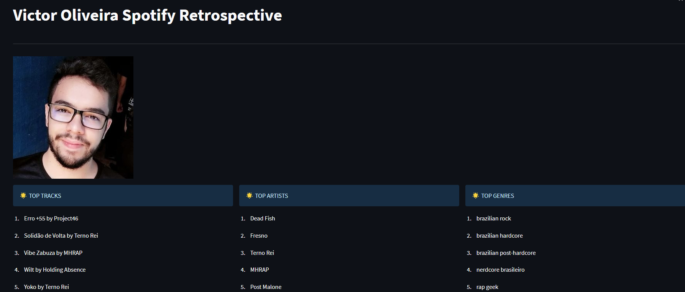

```
# Projeto de Data Science usando a API do Spotify

Este projeto utiliza a API do Spotify para obter informações sobre usuários, principais faixas e principais artistas. Os dados são então armazenados em um banco de dados e processados para criar visualizações interativas usando o Streamlit.

## Configuração do ambiente

Antes de executar o projeto, certifique-se de ter as seguintes dependências instaladas:

- Python 3.x
- Pacotes Python: spotipy, pandas, streamlit, entre outros. (instale as dependências usando `pip install -r requirements.txt`)

Além disso, você precisará criar um aplicativo no [Spotify for Developers](https://developer.spotify.com/dashboard/) e obter as credenciais (CLIENT_ID e CLIENT_SECRET) necessárias para se autenticar na API do Spotify.

## Configuração do ambiente

1. Clone este repositório para sua máquina local.
2. Instale as dependências necessárias executando o seguinte comando:
   ```
   pip install -r requirements.txt
   ```
3. Defina as variáveis de ambiente `CLIENT_ID` e `CLIENT_SECRET` com as credenciais obtidas do Spotify.
4. Execute o aplicativo Streamlit usando o seguinte comando:
   ```
   streamlit run main.py
   ```
5. O aplicativo Streamlit será iniciado e você poderá interagir com as visualizações criadas.

## Funcionalidades

O projeto possui as seguintes funcionalidades principais:

- Obter informações do usuário autenticado.
- Obter as principais faixas do usuário.
- Obter os principais artistas do usuário.

Os dados obtidos da API do Spotify são armazenados em um banco de dados em duas etapas: staging e trusted. A estrutura das tabelas de staging reflete os dados brutos obtidos da API, enquanto as tabelas de trusted armazenam os dados processados e transformados para análise.

## Estrutura do projeto

A estrutura de diretórios do projeto é a seguinte:

```
├── main.py               # Arquivo principal do aplicativo Streamlit
├── spotify_api.py        # Classe que interage com a API do Spotify
├── database.py           # Classe que gerencia o banco de dados
├── README.md             # Este arquivo
└── requirements.txt      # Arquivo com as dependências do projeto
```

## Licença

Este projeto é licenciado sob a [MIT License](https://opensource.org/licenses/MIT).

## Imagem do Frontend
```

<p align="center">
  
</p>


